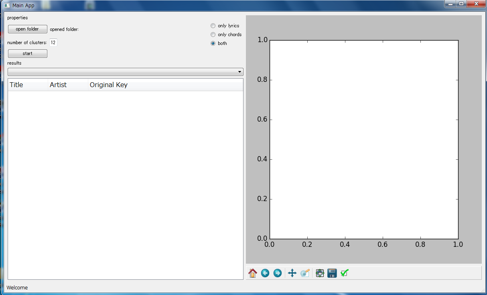

# NITKC_Research
釧路高専専攻科 特別研究2

# 依存モジュール
BeautifulSoup4  
scipy  
sklearn  
numpy  
nltk  
PyQt4  
matplotlib  
pylab  
pandas  
MeCab  
CaboCha  
lxml  

# 使い方
1. 起動: python MainApp.py  
  
2. フォルダー選択: "open folder"  
3. 分類モード選択:  
・"only lyrics": 歌詞情報のみ  
・"only chords": コード進行情報のみ  
・"both": 両方  
4. 分類クラスタ数設定: "number of clusters" 右テキストボックス  
5. 分類開始: "start"  

