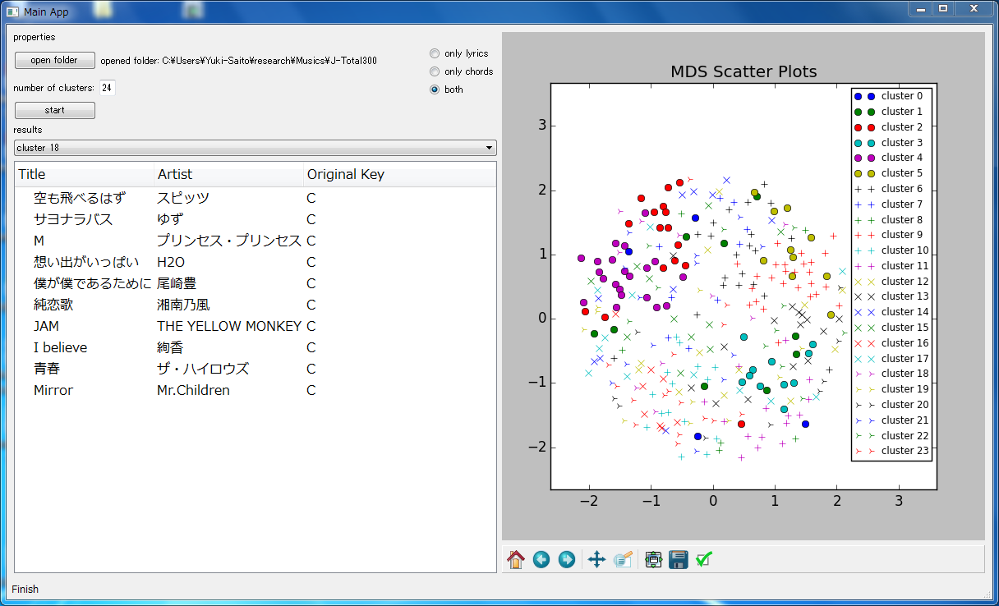

# NITKC_Research
釧路高専専攻科 特別研究2  
*"コード進行および歌詞情報を用いた楽曲分類システムの構築"*  

# 依存モジュール
BeautifulSoup4  
scipy  
sklearn  
numpy  
nltk  
PyQt4  
matplotlib  
pylab  
pandas  
MeCab  
CaboCha  
lxml  

# 使い方
## 起動～分類まで
1. 端末上で python MainApp.py により起動します.  
  
2. "open folder" から, 楽曲ファイルが格納されているフォルダを指定します.  
3. 分類モードを選択します.   
・"only lyrics" → 歌詞情報のみを利用  
・"only chords" → コード進行情報のみを利用  
・"both" → 歌詞情報/コード進行情報の両方を利用  
4. "number of clusters" 右テキストボックスから分類クラスタ数を指定します.  
5. "start" で分類開始です.  
## 分類結果確認
  
・"results" 下部に各クラスタのデータが表示されます.  
・"results" 真下の "cluster XX" ダイアログを利用すると結果を表示するクラスタを変更できます.  
・画面右に Multi-Dimensional Scaling (MDS) を用いた特徴空間の2次元プロットが表示されます.  
・各クラスタのデータをクリックすることで, 歌詞情報に基づく楽曲の印象分析結果を確認できます (下図).  

## 終了
右上の×ボタンから終了してください.  
